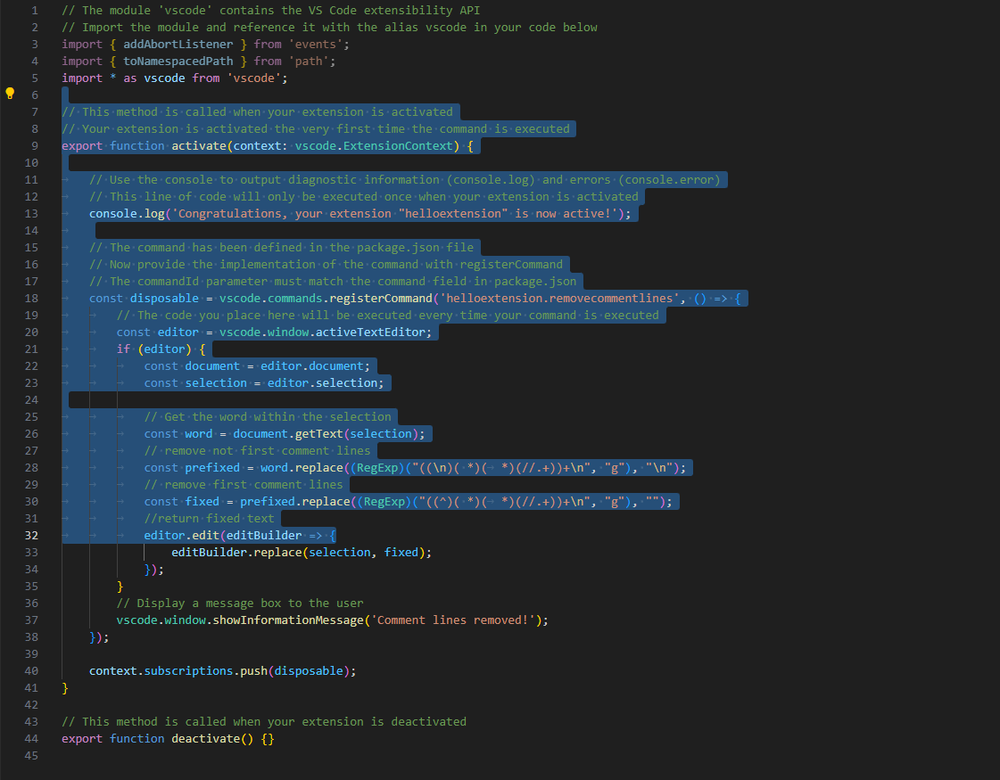
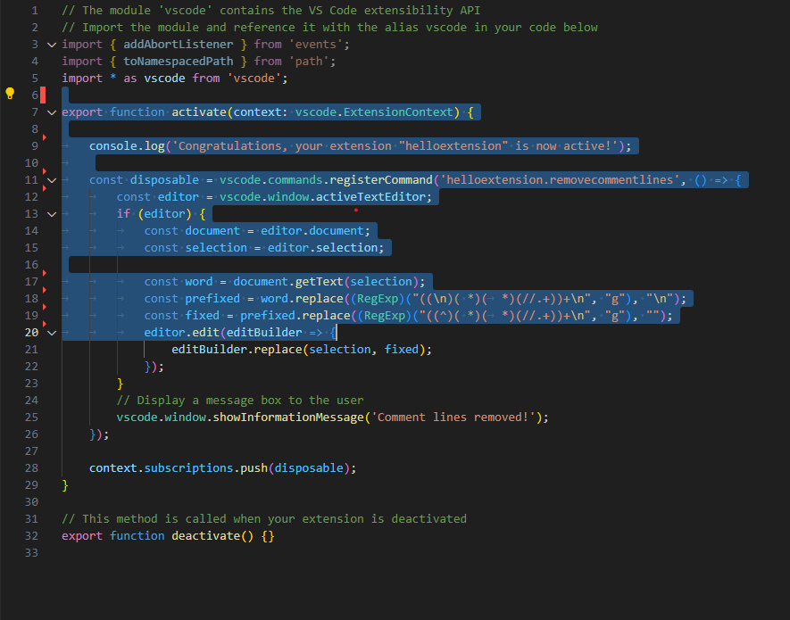

# helloextension README

## Features
### Commands
- Command Remove comment lines (ctrl+f6 by default)

Before 

After

This command deletes lines that contain only comments.
This command simply applies the regular expressions mentioned below to the selected text.

((RegExp)("((\n)( \*)(\t*)(//.+))+\n", "g"), "\n");

((RegExp)("((^)( \*)(\t*)(//.+))+\n", "g"), "");
## Release Notes

* 48a5ebe (HEAD -> CLRemover, origin/CLRemover) more docs
* 4211d8b docs2
* 70b7bfc Release Notes update
* d7573cb documentation
* e5862b5 comment line remover
* cdc30c8 (origin/master, master, delete) new extension