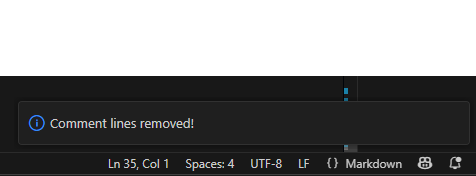

# helloextension README

## Features
### Commands
- Command Remove comment lines (ctrl+f6 by default)

Before 

After

This command deletes lines that contain only comments.
This command simply applies the regular expressions mentioned below to the selected text.

((RegExp)("((\n)( \*)(\t*)(//.+))+\n", "g"), "\n");

((RegExp)("((^)( \*)(\t*)(//.+))+\n", "g"), "");

## Files
### src/extension.ts

> <code>export function activate(context: vscode.ExtensionContext)</code>:

    Your extension is activated the very first time the command is executed. Activates your function.
    Takes collection of utilities private to an extension.
    Returns void.
    Used to activate extension

> <code>const disposable = vscode.commands.registerCommand('helloextension.removecommentlines', () => {})</code>:

    Register your command with id 'helloextension.removecommentlines', commands in {} will be passed to this function as lambda function.
Example:
<code>vscode.window.showInformationMessage('Comment lines removed!');</code>
This will show notification with text 'Comment lines removed!':

> <code>export function deactivate() {}</code>:

    Takes nothing.
    Returns void.
    Here can be described commends whitch must be executed when extension is deactivated.
    Used to deactived extension

## Release Notes

* 48a5ebe (HEAD -> CLRemover, origin/CLRemover) more docs
* 4211d8b docs2
* 70b7bfc Release Notes update
* d7573cb documentation
* e5862b5 comment line remover
* cdc30c8 (origin/master, master, delete) new extension